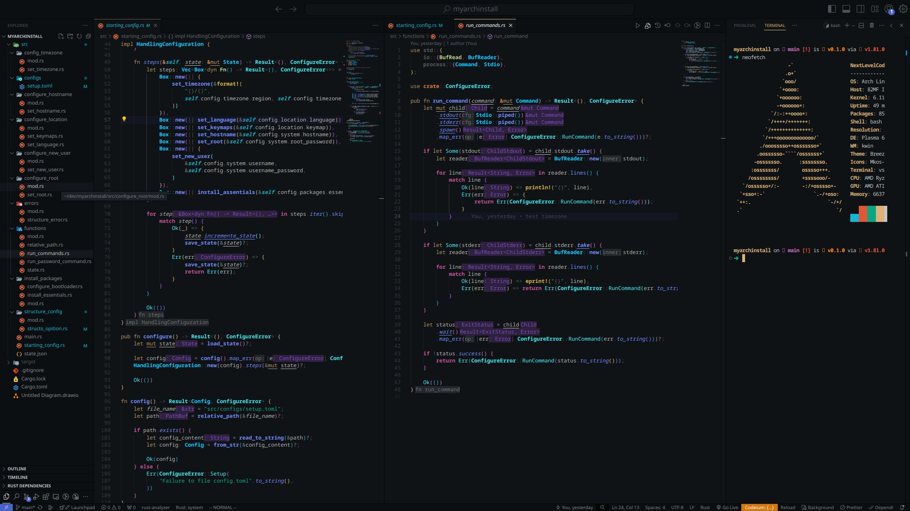

# MyArchInstall: v1

Automatize a instalação do Arch Linux com facilidade. Este script em Rust foi criado para agilizar o processo de configuração que faço sempre que mudo de sistema (algo frequente, nem pergunte!). A ferramenta cobre as configurações iniciais essenciais que realizo antes do primeiro boot no sistema já instalado (sem interface gráfica e com configurações básicas).



## Índice

- [Descrição](#descrição)
- [Configuração Inicial](#configuração-inicial)
- [Pré-requisitos](#pré-requisitos)
- [Como Usar](#como-usar)
- [Licença](#licença)

## Descrição

As pastas do projeto estão organizadas por etapa do processo de instalação. O arquivo de configuração `src/configs/setup.toml` permite especificar suas preferências para o sistema. Caso ocorra algum erro, o script cria um arquivo `src/state.json` para registrar o progresso, facilitando a retomada da instalação.

## Configuração Inicial

No arquivo `src/configs/setup.toml`, configure as opções conforme suas preferências. Abaixo está um exemplo de configuração padrão:

### Localização
```toml
region = "America"
city = "Sao_Paulo"
```

### Idioma e Teclado
```toml
language = ["en_US.UTF-8 UTF-8"]
keymap = "br-abnt2"
```

### Sistema
```toml
hostname = "arch"
root_password = "arch"
username = "arch"
username_password = "arch"
```

### Pacotes Essenciais
```toml
essentials = [
    "dosfstools",
    "os-prober",
    "mtools",
    "network-manager-applet",
    "networkmanager",
    "wpa_supplicant",
    "wireless_tools",
    "dialog",
    "sudo",
]
```

## Pré-requisitos

### Requisitos Gerais
- Rust: [Instale aqui](https://www.rust-lang.org/learn/get-started)

### Pacotes Necessários

Para Arch Linux:
```bash
sudo pacman -Syu base-devel
```

Para outras distribuições (Debian/Ubuntu):
```bash
sudo apt install build-essential
```

## Como Usar

Clone o repositório e execute o projeto:

```bash
sudo pacman -Syu base-devel rust
git clone https://github.com/m4rc3l04ugu2t0/myarchinstall.git
cd myarchinstall/
cargo run
```

---

## Licença

Este projeto é **totalmente livre**. Você pode usar, modificar e distribuir o código conforme desejar. Se você encontrar maneiras de melhorar o projeto, ficarei grato se você puder contribuir com suas alterações através de um **Pull Request**. Agradeço qualquer contribuição para aprimorar o código!

---
